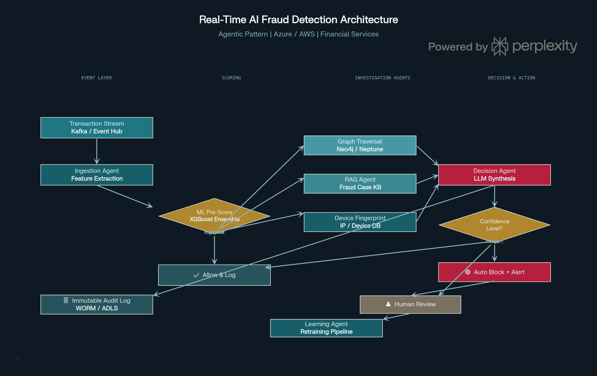
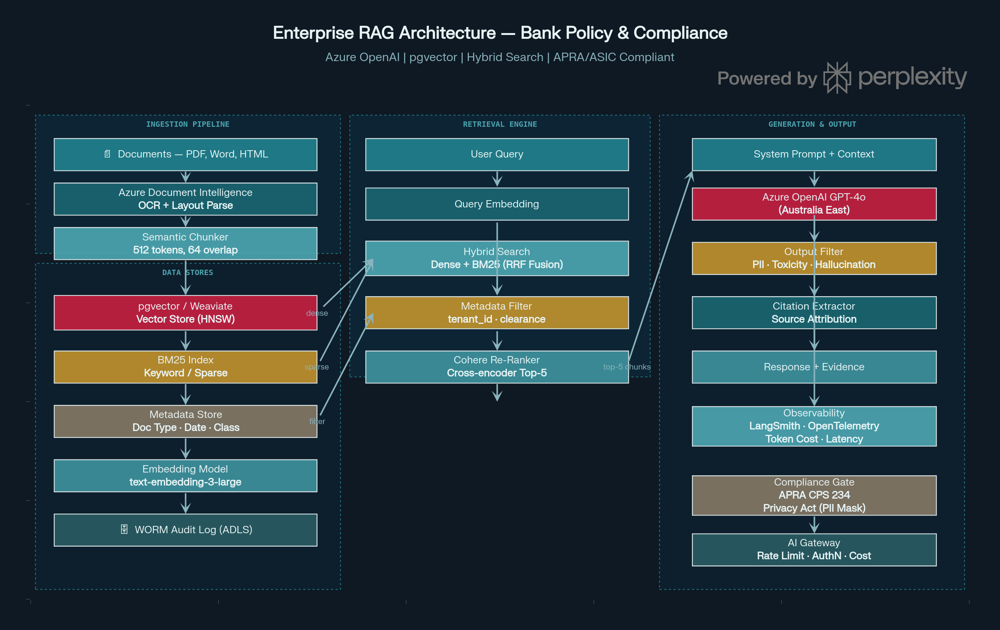
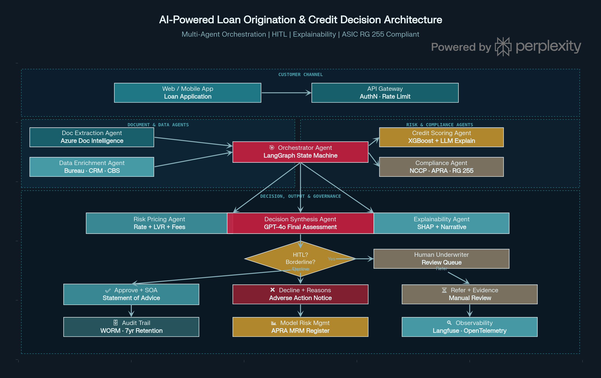
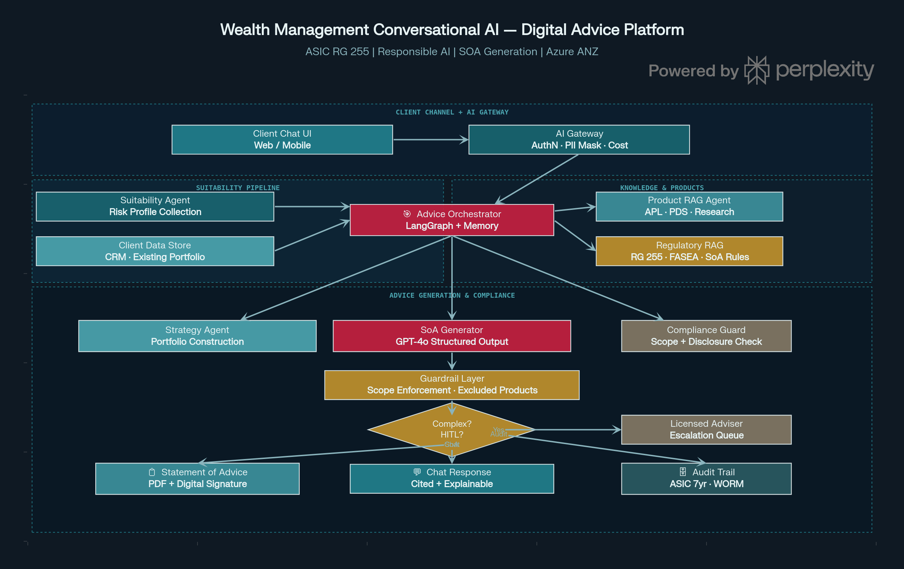

Here are **4 enterprise-grade AI architecture diagrams** for banking and financial services, each addressing a distinct use case:

Architecture 1 — Real-Time AI Fraud Detection
---------------------------------------------

This architecture processes transactions in real-time through a two-stage approach. A fast ML pre-scorer (XGBoost ensemble) filters the high-volume stream, routing only suspicious transactions to the expensive **Investigation Agent cluster** — which runs parallel Graph Traversal (Neo4j for relationship networks), RAG against a fraud case knowledge base, and device/IP fingerprinting. The **LLM Decision Agent** synthesises all signals into an explainable risk score, routing to auto-block, human review queue, or allow. Every decision is written to an immutable WORM audit log, and confirmed fraud cases feed back into the **Learning Agent** for continuous retraining.

**Key design decisions:**

*   Two-stage scoring keeps latency under 200ms for 95% of transactions (ML pre-score only)
    
*   Graph RAG detects ring fraud / account-sharing networks invisible to vector search alone
    
*   Human review queue for medium-confidence decisions ensures regulatory compliance (ASIC, AUSTRAC)
    
*   Immutable audit log with hash chaining provides tamper-evident evidence for legal proceedings
    

Generated chart: fraud\_arch.png

Architecture 2 — Enterprise RAG for Policy & Compliance
-------------------------------------------------------

This architecture is specifically designed for banks managing large repositories of policy documents, regulatory guidance (APRA prudential standards, ASIC regulatory guides), and internal procedures. The ingestion pipeline uses Azure Document Intelligence for layout-aware parsing — critical for PDFs with complex tables and multi-column regulatory documents. Embeddings are stored in **pgvector with HNSW indexing**, alongside a BM25 sparse index. At query time, **Hybrid Search (RRF fusion)** combines dense semantic matching with exact keyword matching — essential when queries mix natural language ("what is the policy on...") with precise regulatory citations ("CPS 234 paragraph 42").

**Key design decisions:**

*   Hybrid search consistently outperforms either dense or sparse alone for financial terminology
    
*   Cohere Re-Ranker cross-encoder in Stage 2 improves top-5 precision before injecting into GPT-4o context
    
*   Azure OpenAI in **Australia East region** ensures data residency (APRA, Privacy Act)
    
*   Compliance Gate enforces PII masking and APRA CPS 234 security controls at output
    

Generated chart: rag\_compliance\_arch.png

Architecture 3 — AI Loan Origination & Credit Decision
------------------------------------------------------

This multi-agent architecture automates the loan origination workflow end-to-end while remaining compliant with ASIC RG 209 responsible lending obligations. A **LangGraph Orchestrator** coordinates four specialist agents in parallel: Document Extraction (Azure DI), Credit Scoring (XGBoost with LLM-generated explanations), Compliance (NCCP Act checks), and Risk Pricing. The **Decision Synthesis Agent** (GPT-4o) integrates all signals and reaches a preliminary decision.

**Key design decisions:**

*   HITL diamond gate: borderline cases (credit score within ±30 points of threshold) route to human underwriters — never auto-decided by AI alone
    
*   **Explainability Agent** generates SHAP values + natural language explanation for every decision, meeting ASIC's adverse action notice requirements
    
*   Governance row (bottom layer): WORM audit trail, APRA Model Risk Management register, and Langfuse observability are mandatory — not optional
    
*   Decline decisions generate a structured **Adverse Action Notice** with legally required reasons
    

Generated chart: loan\_origination\_arch.png

Architecture 4 — Wealth Management Digital Advice (ASIC RG 255)
---------------------------------------------------------------

This is the most governance-intensive of the four architectures, designed to operate under ASIC Regulatory Guide 255 (Digital Advice). The **Suitability Agent** conducts a structured fact-find dialogue to establish the client's risk profile before any advice is generated. Product recommendations are scoped to the firm's **Approved Product List (APL)** via a Product RAG Agent — the Compliance Guardrail Layer enforces that no advice references excluded financial products without a licensed adviser in the loop.

**Key design decisions:**

*   **Scope Enforcement Guardrail**: the LLM is architecturally prevented from recommending any product outside the APL scope — not just prompted, but enforced via structured output schema validation
    
*   Complex queries (multiple assets, SMSFs, margin loans) trigger mandatory HITL escalation to a **Licensed Financial Adviser** queue — this is a regulatory requirement, not a quality choice
    
*   **Statement of Advice (SoA)** is generated as a structured PDF with digital signature, citing the source documents used — satisfying ASIC's disclosure obligations
    
*   All advice sessions retained for **7 years** in WORM storage per ASIC record-keeping requirements
    

Generated chart: wealth\_advice\_arch.png

Colour Legend & Shared Patterns
-------------------------------

All four architectures share these **cross-cutting concerns** that you should emphasise in your Datacom interview:

PatternApplied InWhy It Matters**WORM Audit Log**All 4APRA/ASIC 7-year retention + tamper evidence**AI Gateway**All 4Centralised AuthN, PII masking, cost tracking**HITL Gate**Fraud, Loan, WealthRegulatory requirement for consequential decisions**Observability (OpenTelemetry)**All 4Token cost, latency, quality drift detection**Data Residency (ANZ)**All 4Privacy Act + APRA CPS 234 data sovereignty**Hybrid Search**RAG, Fraud, WealthOutperforms pure vector search for financial text**Structured Output + Citations**All 4Prevents hallucination in regulated