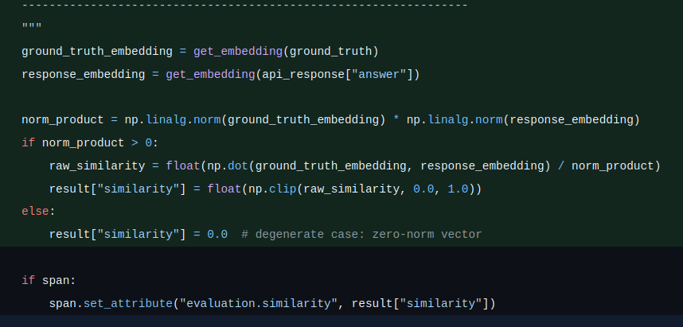

# Exercise Tasks

## 📊 Task 2: Evaluate Model Performance (15 minutes)

Implement the similarity score calculation logic.

Run the evaluation script:
```bash
python evaluation/evaluate.py --sample-size 20
```

---

### 🐛 BUG 1: Bare Return in `get_embedding`

| File Name | Function | Line Number |
| :--- | :--- | :--- |
| `evaluate.py` | `get_embedding` | `63` |

#### ⚠️ Problem Detail
`get_embedding()` returned `None` (due to a bare `return` statement).

#### 🔍 Root Cause
- The original line 63 was `return` with no value, which crashes or silently zeros all similarity scores.
- Python treats a bare `return` as `return None`, so every call to `get_embedding()` handed `None` to the cosine similarity math, causing an immediate `TypeError` or silently producing a `0.0` similarity score for every safe query.
- The Ollama embeddings API responds with:
  ```bash
    curl -X POST http://localhost:11434/api/embed \
    -H "Content-Type: application/json" \
    -d '{
      "model": "nomic-embed-text",
      "input": "Your text goes here"
    }'
  ```
  ```json
  {
    "embedding": [0.123, -0.456, ...]  // List of float values
  }
  ```

#### 🛠️ Fix
Extract the `"embedding"` key and wrap it in `np.array()` so the caller receives a numpy vector ready for dot-product / norm arithmetic.

* **Args:**
  - `text`: Text to embed.
  - `base_url`: Ollama API base URL.
  - `model`: Embedding model name (default: `nomic-embed-text`).
* **Returns:**
  - Numpy array containing the embedding vector (typically 768-dim for `nomic-embed-text`).

```python
# Remove return, add below:
data = response.json()
return np.array(data["embedding"], dtype=np.float32)
```

---

### 🐛 BUG 2: Empty Similarity Calculation Block

| File Name | Function | Location |
| :--- | :--- | :--- |
| `evaluate.py` | `_evaluate_response_internal` | `# Calculate similarity score between ground truth and api response` |

#### ⚠️ Problem Detail
The similarity calculation block was completely empty.

#### 🔍 Root Cause
- Lines 144-148 contained only a comment stub:
  ```python
  # Calculate similarity score between ground truth and api response
  ```
- No code followed it, so `result["similarity"]` remained `0.0` for every safe query, making the metric meaningless. The evaluation report would always show `0.000` average similarity regardless of how well the LLM actually answered.

#### 🛠️ Fix — Cosine Similarity via Ollama Embeddings
1. Embed the ground-truth answer and the LLM's actual answer using `get_embedding()` (now fixed to return a numpy array).
2. Compute cosine similarity:
   $$\text{cosine}(\mathbf{a}, \mathbf{b}) = \frac{\mathbf{a} \cdot \mathbf{b}}{\|\mathbf{a}\| \cdot \|\mathbf{b}\|}$$
   Returns a value in $[0, 1]$:
   - `1.0` = semantically identical
   - `0.0` = completely unrelated
3. Clip to $[0, 1]$ for safety — embedding dot products can occasionally produce tiny negatives due to floating-point.

```python
def cosine_similarity(vec_a: np.ndarray, vec_b: np.ndarray) -> float:
    # cos(θ) = (A · B) / (||A|| × ||B||)
    norm_a = np.linalg.norm(vec_a)
    norm_b = np.linalg.norm(vec_b)
    if norm_a == 0.0 or norm_b == 0.0:
        return 0.0
    return float(np.dot(vec_a, vec_b) / (norm_a * norm_b))
```

```python
ground_truth_embedding = get_embedding(ground_truth)
response_embedding = get_embedding(api_response["answer"])
        
norm_product = np.linalg.norm(ground_truth_embedding) * np.linalg.norm(response_embedding)
if norm_product > 0:
    raw_similarity = float(np.dot(ground_truth_embedding, response_embedding) / norm_product)
    result["similarity"] = float(np.clip(raw_similarity, 0.0, 1.0))
else:
    result["similarity"] = 0.0  # degenerate case: zero-norm vector

if span:
```

