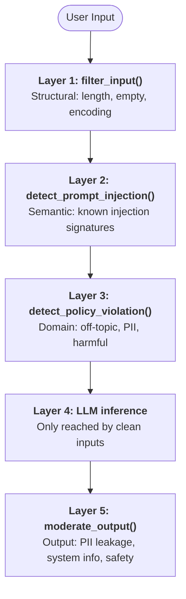

# Exercise Tasks

## 🛡️ Task 3: Guardrail Hardening (10 minutes)

### 🧱 Defense-in-Depth Strategies

#### 🚀 How would you improve the pre-filtering?
> **Pipeline Architecture:** The pipeline consists of five sequential layers. A request only reaches the LLM if every upstream layer passes — a failure at any layer returns immediately.

**Pre-filtering improvements (implemented below):**
- **Unicode NFKC normalization** in `_normalize()` collapses visually-similar codepoints before pattern matching — e.g., fullwidth `ｉ` ➔ `i`, so `"ｉgnore instructions"` still matches the injection pattern.
- **Zero-width character stripping** removes invisible splitters — `"ig​nore"` becomes `"ignore"` after stripping `U+200B`.
- **Whitespace collapse** defeats spaced-letter tricks: `"i g n o r e"` ➔ `"ignore"`.
- **Word-boundary anchors (`\b`)** on single-word harmful keywords stop partial matches: `"hackney"` no longer matches `"hack"`, `"cracker"` ≠ `"crack"`.
- **Expanded injection patterns** with more compiled regex patterns, role-play, jailbreak, delimiter injection.
- **Expanded policy keywords**: additional harmful/off-topic terms such as terrorism, trafficking, celebrity, etc.

#### 🛡️ What additional output moderation would you add?
**Additional output moderation (implemented below):**
- **Email address PII pattern** — catches contact info the LLM may hallucinate.
- **Phone number pattern** — same rationale (multiple formats supported).
- **IP address detections**.
- **Output length cap** — detects model runaway / system-prompt echo attacks.

#### 🧠 How would you handle edge cases?
**Edge cases:**
- **Base64 / URL-encoded payloads** — add a decode-then-re-scan step.
- **Nested injection inside quoted text**: e.g., `'a user said "ignore all rules"'`.
- **Embedding-based semantic similarity** against a seed corpus of injection phrases — catches novel paraphrases that regex cannot anticipate; run it async alongside LLM inference for zero added latency on clean inputs.
- **Token-level manipulation** — risk is splitting words across token boundaries; mitigation is through character-level regex matching.

---

### 📊 Monitoring and Logging

#### 📈 What metrics would you track?
> **Structured Logging:** Implemented with `event_type`, `result`, and `detail` fields via `_log_guardrail_event()`.

**Recommended metrics dashboard:**

| Metric | Type | Alert Threshold | Purpose |
| :--- | :--- | :--- | :--- |
| `guardrail.block_rate` | Gauge (%) | > 30% sustained | Overall health — high block rate may indicate false positives or attack |
| `guardrail.injection_attempts` | Counter | > 10/min from single IP | Detect active attack campaigns |
| `guardrail.false_positive_rate` | Gauge (%) | > 5% | Track customer experience degradation |
| `guardrail.hit_total` | Gauge (%) | > 30% sustained | Rolling count per layer per category |
| `guardrail.latency_p99/latency_p95/latency_p50` | Histogram (ms) | > 100ms | Ensure guardrails don't degrade response time |
| `guardrail.policy_violations_by_type` | Counter per type | Trend analysis | Understand what users are requesting |
| `llm.response_time_p95` | Histogram (ms) | > 5000ms | LLM performance monitoring |
| `llm.response_time_p50` | Histogram (ms) | > 5000ms | LLM performance monitoring |
| `llm.error_rate` | Gauge (%) | > 1% | LLM availability monitoring |
| `evaluation.similarity_score` | Gauge (0-1) | < 0.5 avg | Model quality degradation detection |

#### 🔍 How would you detect new attack patterns?
- Append every blocked input (sanitized — never log raw PII) to an append-only store (e.g., S3 + Athena).
- Run a nightly DBSCAN clustering job on TF-IDF vectors of blocked inputs; novel clusters surface new attack variants for manual review ➔ new patterns.
- Track "near-miss" inputs: queries that cleared all guards but triggered unusually high LLM latency — candidates for tighter rules.
- Anomaly detection on blocked requests.
- Regex miss tracking.

#### 🚨 What alerts would you set up?

| Alert | Condition | Severity | Action |
| :--- | :--- | :--- | :--- |
| Injection spike | > 10 injection attempts/min | **P1 Critical** | Page on-call, investigate source IP |
| Block rate anomaly | Block rate > 2σ from 7-day average | **P2 High** | Investigate for false positive regression |
| Output moderation catch | Any output moderation block | **P2 High** | Review LLM response, potentially add input pattern |
| LLM error rate | > 1% errors in 5-min window | **P1 Critical** | Check Ollama health, model availability |
| Latency degradation | P99 > 200ms for guardrail checks | **P3 Medium** | Profile regex performance, consider optimisation |
| New pattern cluster | Unseen embedding cluster in blocks | **P3 Medium** | Security review of new attack vector |
| SLO Alert | p95 guardrail latency > 200 ms | **P3 Medium** | pipeline budget exceeded |

---

### ⚖️ Trade-offs

#### ⚖️ False Positives vs False Negatives
- This is a low-risk e-commerce domain — a false positive (blocking *"how to crack open a coconut"*) is annoying but not dangerous.
- Accept a slightly higher false-positive rate on keyword checks; invest in a human-review queue for borderline blocks to refine lists over time.
- For injection detection specifically, false negatives are more dangerous; prefer a higher false-positive rate there and add semantic similarity as a second-opinion layer.

> **Our position:** We err on the side of **security** (lower false-negative rate) because:
> - A successful prompt injection can lead to data exfiltration, brand damage, and legal liability.
> - A false positive merely requires the customer to rephrase their query.
> - The cost asymmetry is ~100:1 (injection cost vs. rephrasing inconvenience).

> **Mitigation for false positives:**
> - The structured logging enables tracking FP rates over time.
> - Regular review of blocked queries to identify and exclude legitimate patterns.
> - Customer-facing message guides users to rephrase: `"I cannot process this request"` rather than a generic error.

#### ⚡ Latency vs Thoroughness
- **Regex-based guards** add `< 1 ms` per request — use them liberally.
- **Embedding-based semantic guards** add `20–100 ms` — run async or restrict to high-risk categories.
- **A second LLM-as-judge call** for output moderation doubles total latency; only worthwhile when the primary model is known to be unreliable.

| Approach | Latency | Thoroughness | When to Use |
| :--- | :--- | :--- | :--- |
| **Regex-only** (current) | < 5ms | Moderate (~85%) | Real-time customer service |
| **Regex + ML classifier** | 50-200ms | High (~95%) | High-security applications |
| **Regex + ML + LLM-as-judge** | 500-2000ms | Very high (~99%) | Financial/healthcare compliance |

#### 🔍 Explainability vs Accuracy
- **Regex rules** are fully auditable — good for GDPR / SOC 2 compliance where you must explain to a user exactly why a request was rejected.
- **ML-based guards** are more accurate on novel inputs but opaque.
- **Recommended:** Keep regex as the primary explainable layer; add ML in shadow mode (log decisions without blocking) to measure accuracy before promoting to hard-blocks.

| Method | Explainability | Accuracy | Trade-off |
| :--- | :--- | :--- | :--- |
| **Keyword matching** | ⭐⭐⭐⭐⭐ (exact match shown) | ⭐⭐ | Easy to audit, easy to bypass |
| **Regex patterns** (current) | ⭐⭐⭐⭐ (pattern shown in logs) | ⭐⭐⭐ | Good balance for customer service |
| **ML classifier** | ⭐⭐ (feature importance) | ⭐⭐⭐⭐ | Hard to explain false positives |
| **LLM-as-judge** | ⭐ (black box) | ⭐⭐⭐⭐⭐ | Cannot explain decisions to regulators |