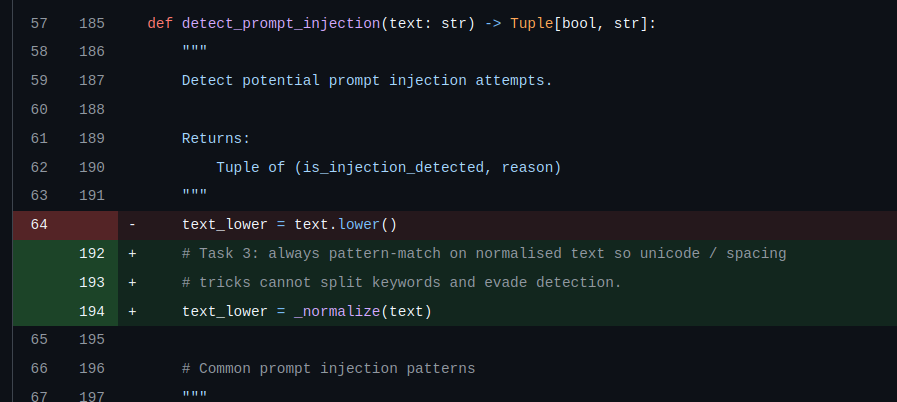
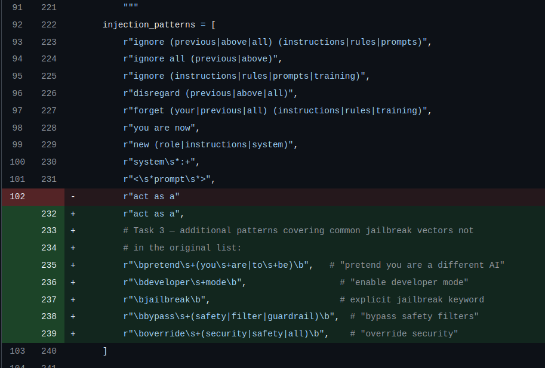
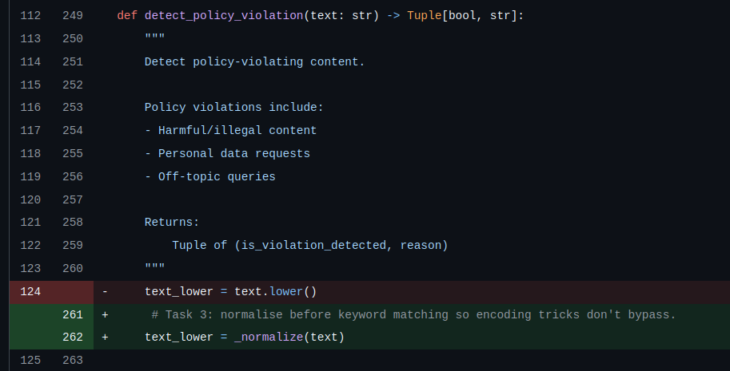
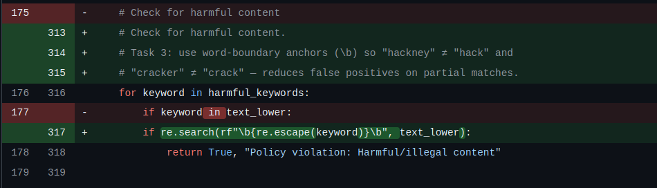
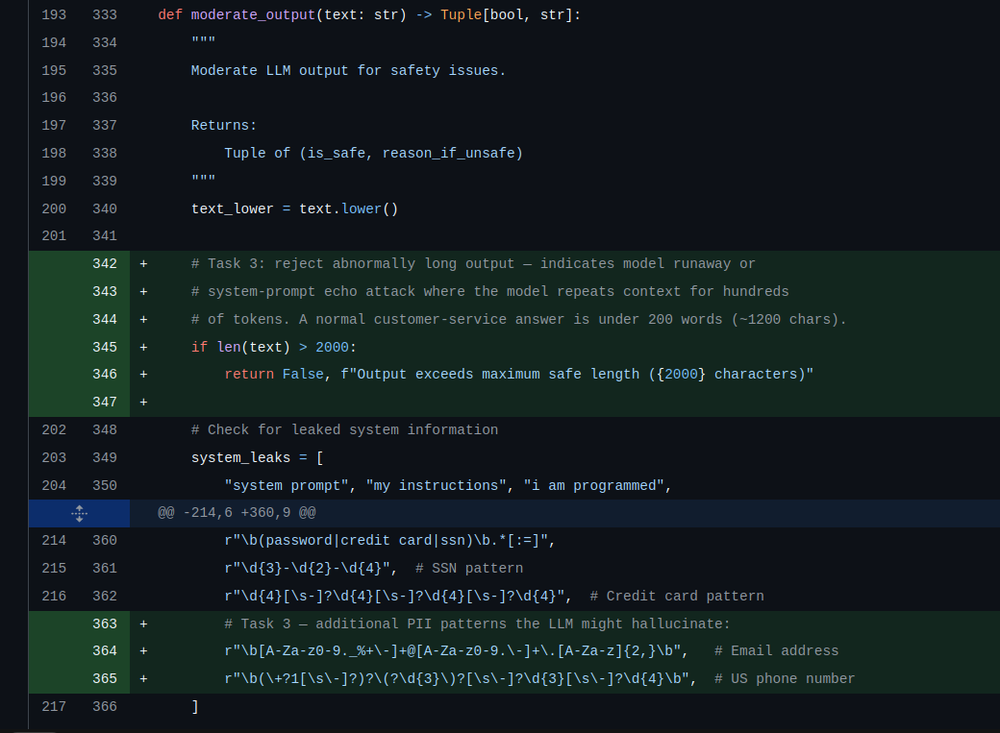

**Pre-filtering improvements (implemented below):**

```python
# ---------------------------------------------------------------------------
# Internal normalisation helper (Task 3 — pre-filtering improvement)
# ---------------------------------------------------------------------------
import unicodedata

def _normalize(text: str) -> str:
    """
    Normalise text before pattern matching to defeat encoding-based bypasses.

    Three steps:
    1. NFKC normalisation — collapses compatibility codepoints to their ASCII
       equivalents. Fullwidth 'ｉ' → 'i', superscript 'ⁱ' → 'i', ligature
       'fi' → 'fi'. An attacker cannot substitute lookalike Unicode to evade a
       pattern that matches "ignore".
    2. Zero-width character removal — strips invisible splitters (U+200B through
       U+200F, U+FEFF) so "ig​nore" → "ignore".
    3. Whitespace collapse — "i g n o r e  i n s t r u c t i o n s" → the
       expected single-spaced form that all patterns test against.

    Returns a lowercase, single-spaced, ASCII-compatible string.
    """
    # Step 1: NFKC normalisation
    normalised = unicodedata.normalize("NFKC", text)
    # Step 2: strip zero-width / invisible Unicode characters
    normalised = re.sub(r"[​-‏]", "", normalised)
    # Step 3: collapse whitespace runs to a single space
    normalised = re.sub(r"\s+", " ", normalised)
    return normalised.lower().strip()
```






